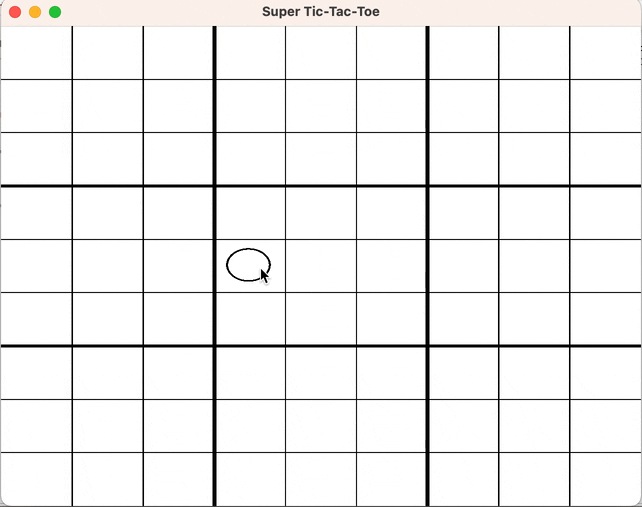

# UltimateT3



A simple rust implementation of [ultimate/super/meta tic-tac-toe](https://en.wikipedia.org/wiki/Ultimate_tic-tac-toe) using [piston](https://github.com/PistonDevelopers/piston) to handle graphics. This project was put together over a weekend to help me learn Rust.

## Running

After [installing the Rust Toolchain](https://www.rust-lang.org/tools/install), use [cargo](https://doc.rust-lang.org/cargo/index.html):

```
cargo run
```
